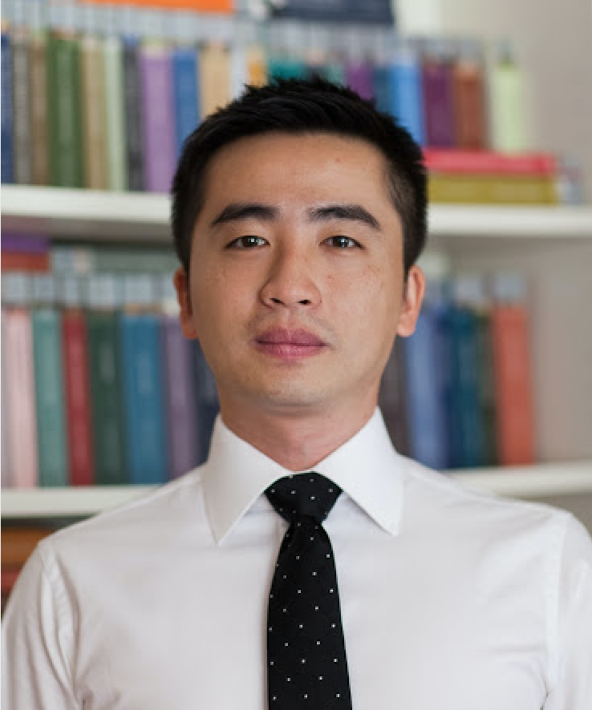
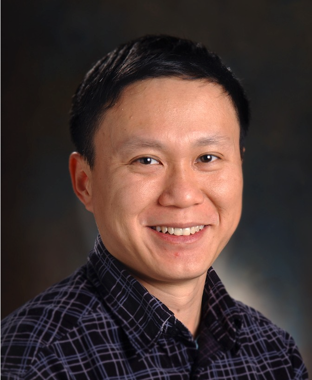

layout: page
---

### Workshop Chairs

<table>
	<tr>
        <td width="30%" height="100%" align="center" valign="top">
            
            Feida Zhu 
            Associate Professor 
            Singapore Management University, Singapore 
        </td>
        <td width="70%" height="100%" align="justify" valign="top">
        	 
        	Dr. Feida Zhu is an associate professor and the associate dean of Singapore Management University. His research interests include large-scale data mining and machine learning, block chain, text mining, graph/network mining and social network analysis, with emphasis on their application to business, financial and consumer innovation. He is also the founder of Symphony, a blockchain-based platform for data-driven economy, with unique set of technology breakthrough in distributed data mining, privacy-preserving data mining, consensus protocol design and blockchain architecture.  He was the General Co-Chair of SIGKDD 2021 in Singapore and the General Co-Chair of ICDM’18, one of the most successful conferences of IEEE for year 2018 with 800 attendees and over 1000 paper submissions.  Feida has initiated the “ICDM Blockchain Day” which has attracted a 300-people audience, with keynote speakers including Dr. C. Mohan from IBM as well as a fleet of top practitioners from leading blockchain projects around the world.  
        </td>
    </tr>
    <tr>
        <td width="30%" height="100%" align="center" valign="top">
            
            Jian Pei 
            Professor 
            Duke University, USA 
        </td>
        <td width="70%" height="100%" align="justify" valign="top">
        	 
            Dr. Jian Pei is a professor of Duke University. He is a well-known leading researcher in the general areas of data science, big data, data mining, and database systems. His expertise is on developing effective and efficient data analysis techniques for novel data intensive applications. He is recognized as a Fellow of ACM for his “contributions to the foundation, methodology and applications of data mining” and as a Fellow of IEEE for his “contributions to data mining and knowledge discovery”. He was the Chair of SIGKDD and the VP of JD.com, in charge of the big data and blockchain department. In the past several years, the JD team has pioneered a large number of successful blockchain applications in large-scale JD business settings under his leadership. Dr. Jian Pei has been the General Co-Chairs and PC Chairs of a good number of top conferences including KDD, VLDB, ICDM, etc.. 
        </td>
    </tr>
    <tr>
        <td width="30%" height="100%" align="center" valign="top">
            
            Mike Zeller 
            Head of AI Strategy and Solutions 
            Temasek, Singapore 
        </td>
        <td width="70%" height="100%" align="justify" valign="top">
        	 
            Dr. Michael Zeller received his Ph.D. from University of Frankfurt, Germany. He is the Head of Artificial Intelligence & Solutions at Temasek and is responsible for the investment company’s AI venture building and accelerating the deployment of AI technologies to create scalable AI products and solutions. From 2013 to 2021, Dr Zeller served severed as Secretary/Treasurer on the Executive Committee of ACM SIGKDD. In 2020, he was honoured with the ACM SIGKDD Service Award in recognition of his outstanding contributions to professional Knowledge Discovery and Data Mining societies or society-at-large through applications of knowledge discovery and data mining. 
        </td>
    </tr>
    <tr>
        <td width="30%" height="100%" align="center" valign="top">
            
            Bingxue Zhang 
            Associate Professor 
            University of Shanghai for Science and Technloogy, China 
        </td>
        <td width="70%" height="100%" align="justify" valign="top">
             
            Dr. Bingxue Zhang received her Ph.D from Ecole Centrale de Lyon, France. She is an associate professor at University of Shanghai for Science and Technloogy, and visiting associate professor at National University of Singapore, carry on her research work in Singapore Blockchain Innovative Programme. She is also the founder of findtruman.io, a content co-creation and gaming platform based on AIGC and blockchain technology, which achieved several blockchain hackathon awards and blochchain Eco Fund supports.  
        </td>
    </tr>
</table>

